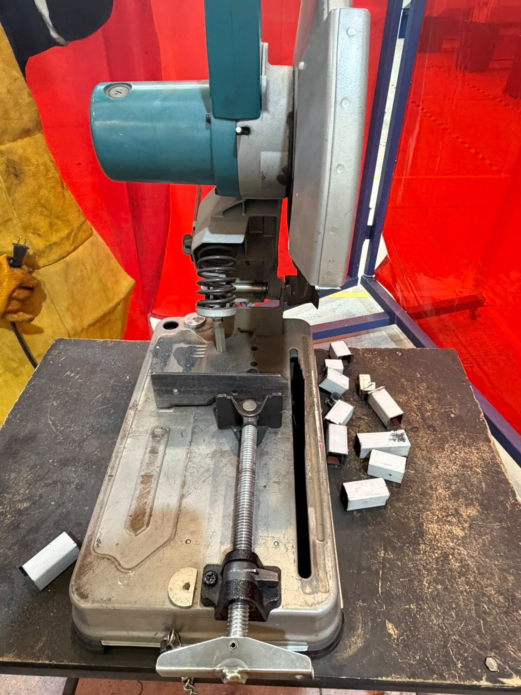
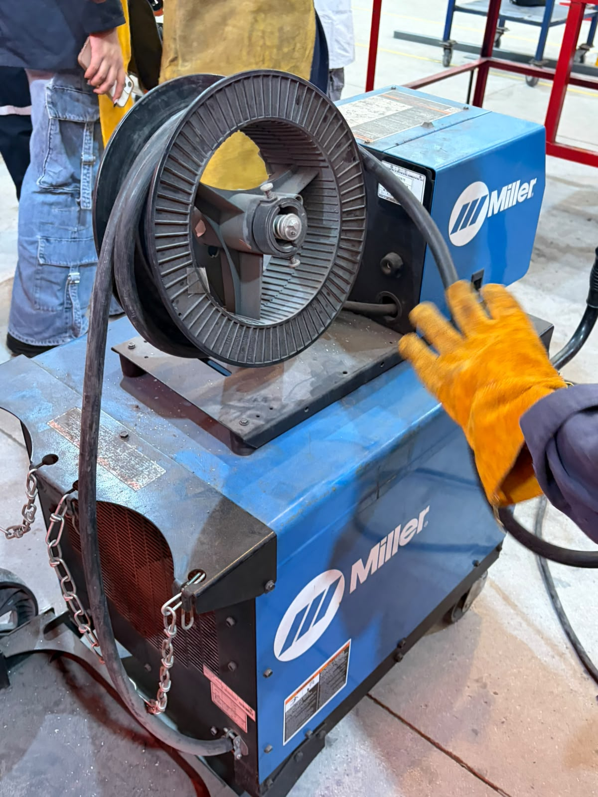

# Práctica 01: Soldadura, corte y eliminación de rebabas

## Objetivo

Conocer y realizar algunos procesos básicos de trabajo con materiales metálicos, como la soldadura, el corte de tubos y la eliminación de rebabas, utilizando las herramientas y máquinas correspondientes.

## Introducción

En esta práctica realizamos diferentes actividades relacionadas con el trabajo en un taller de ingeniería. Aprendimos algunos aspectos básicos de la soldadura, realizamos cortes en tubos y posteriormente eliminamos las rebabas que quedaron en los bordes.

## Desarrollo de la práctica

### 1. Soldadura

Primero aprendimos los aspectos básicos para realizar una soldadura. Utilizamos una máquina de soldar y practicamos la unión de piezas metálicas.

Durante esta actividad fue importante utilizar el equipo de protección y tener cuidado al trabajar con la máquina, nuestra protección fue casco para soldar, botasindustriales, overol, pechera, guantes y lentes.

### 2. Corte de tubos

Después realizamos cortes en algunos tubos utilizando una máquina de corte, esta máquina tiene un disco y corta perfectamente los tubos.

### 3. Eliminación de rebabas

Después de realizar los cortes, los tubos quedaron con algunas rebabas en los bordes.

Utilizamos una máquina para eliminar las rebabas que quedaban, se eliminan las que quedan por fuera, son las que estorban y pueden lastimar.

## Evidencias

Evidencias/
## Evidencias

### Equipo de protección personal

### Cortadora

### Soldadora

### Electrodos

### Piezas para soldar

### Tubos cortados

### Máquina para quitar las rebabas

### Tubo pulido

### Tubo soldado

### Tubo cortado, pulido y unido

